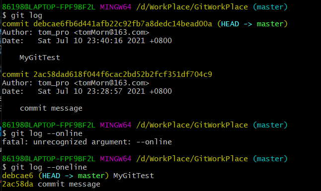

# Git笔记

## 一、简介

#### 1.基础知识

+ 工作区(写代码)  -->  (git add)  -->  暂存区(临时存储)  -->  (git commit)  -->  本地库(历史版本)
+ Git和代码托管中心
  + 代码托管中心任务：维护远程库
  + 局域网环境下： GitLab 服务器（在Linux上布局）
  + 外网环境下：GitHub、码云

+ 本地库和远程库的介绍

  + 团队内部协作
  + 

  

  + 团队外部协作
  + 

+ 版本控制具备的功能
  + 协同修改、数据备份、版本管理、权限控制、历史记录、分支管理
  + SVN采用增量式管理方式(集中式版本控制工具)、Git采取了文件系统快照方式(分布式版本控制工具)

#### 2.Git实践操作

##### Git命令行操作

+ 本地库操作
  + 本地库的初始化(建立git仓库)  命令：git init
    - .git 目录中存放的是本地库相关的子目录和文件，不得修改删除(_linux 以点 . 开头的目录都是隐藏目录_)
    - 
    - config就是配置文件
  + 设置签名：用于区分不同的开发人员、不是真实的
    + 用户名：tom
    + Email地址：tomMorn@163.com  
    + 命令：项目级别优先于系统用户级别、不能缺少
      + 项目级别/仓库级别：在本地范围内有效
        + ==git config user.name tom==
        + ==git config user.email tomMorn@163.com==
      + 保存的位置：
      + 系统用户级别：登录当前操作系统的用户范围
        + ==git config --global user.name tom==
        + ==git config --global user.email tomMorn@163.com==
      + 保存的位置：
      + ~ 波浪线表示当前的家目录
  + 基本操作命令：
    + 状态查看(工作区、暂存区):git status
    + 添加操作(新建/修改到暂存区):git add [file name]
    + 提交操作(将暂存区的内容提交到本地库  "  "  双引号里面为注释信息)
      + git commit -m "commit message" [file name]
    + 查看历史记录：git log(完整形式)、git log --pretty=oneline、git log --oneline
      + git reflog(可用于前进或者后退)
      + 
    + 通过历史记录前进和后退历史版本 git reset --hard[查询时的哈希值 如2ac58da]
      + 找回删除的文件（前提是删除前已经把文件提交到本地库）
    + 
    
    + 删除文件rm [文件名]
      + 
    + 比较文件的差异
      + git diff [文件名]      ->将工作区中的文件和暂存区的文件进行比较
        + 
      + git diff [本地库的历史版本] [文件名]       ->将工作区的文件和本地库历史记录比较
        + 
        
      + > 流程总结：在对应文件夹Git Bash    ->    mkdir filename    ->    cd   filename   ->git init
        >
        > ->   将要上传的文件复制到该文件   ->   git add .    (注意：后面加上空格和. 表示当前目录的所有东西)
        >
        > ->   git status(查看状态，可不操作)   ->git commit -m "注释"    ->  连接远程仓库 
        >
        > ->   git remote add origin (address of repository)    ->   git push -u origin master
##### 分支操作

  + 
  + 分支操作命令
    + 查看分支 git branch -v
    + 创建分支 git branch [分支名]
    + 切换分支 git checkout [分支名]
    + 合并分支
      + git checkout [被合并的分支名]
      + git merge [有新内容的分支名]
  + 分支出现冲突(两个人同时更改一个部分)
    + 编辑文件，删除特殊符号，把文件修改到满意程度，保存退出
    + git add [文件名]   ，  ==git commit -m[日志信息]         {注意：不添加文件名}==

---

+ git基本原理：底层采用SHA-1的算法（下载文件时可以通过比对哈希值来确定是否出现文件损坏）

  

##### git和gitHub的操作

  + 在github上创建远程库（网页操作，获取一个https协议的地址或者SSH协议地址）

  + 在git上创建本地库

    + 
    + git remote -v查看代替的变量    git
    + git remote add [变量名]   变量值     ->取代简化作用
    + 
    + ll  或者 ls -la为查看当前目录
    + ==git push [https协议地址] [master或者其他分支]          ->把本地库推送到远程库==
    + git clone [远程地址]   ->把远程库克隆到本地库
      + 作用3个：从远程库下载到本地库、创建远程地址别名、初始化本地库
    + 团队成员要加入时需要在github上进行邀请
    + 拉取到本地库pull
      + ==pull = fetch + merge==
        + git fetch [远程库地址别名] [远程分支名]
        + git checkout  [远程库地址别名/远程分支名]   ->查看一下内容再确定
        + git merge [远程库地址别名/远程分支名]    如 git merge origin/master
      + git pull [远程库地址别名] [远程分支名]
    + 解决冲突：一个原版本、两个新版本、一个新版本推送上去了、另一个新版本推送时发生冲突、需要先拉取下来合并再重新推送（跟分支冲突差不多）

  + 跨团队协作

    + 

  + SSH免密操作，复制ssh的操作地址(git仓库和github仓库传输的需要)

    + 

    + 

      

  

